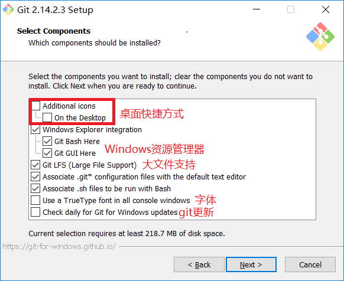

首先呢，先说一下吧，这是本人第一次写博客，也是在大学生时代的一个想法，现在终于实现了。
花了几天的时间，研究了一下，颇有收获，而我在找资料的过程中，都是这个博客找点那个博客找点，都没有一个博客的教程是很详细且到位的，哎，醉了，感谢你们一直看到这里听我在这里碎碎念，最后啰嗦一句，有什么问题，及时下方评论(不是私信)，因为我几乎每天登陆博客，所以看到后会及时回复大家的。
<!-- more -->
环境配置：
	电脑系统为window 10专业版，64位，Nodejs, Github, Hexo, livere, Leancloud, ShareSDK, Dalao。
## 相关步骤
### 安装Node.js和配置好Node.js环境,我的版本10.11.0
1、访问官方地址 https://nodejs.org/en/download/ 根据自己的系统进行下载。


2、检测是否安装成功：点击开始-运行-cmd（win+R），打开dos，输入“node --version”检查Nodejs版本；输入“npm --version”检查npm版本：

3、这里我们要分两步，第一步修改NPM的缓存目录和全局目录路径，将对应的模块目录改到D盘nodejs的安装目录，第二步是配置npm和nodejs的环境变量，这样nodejs才能正确地调用对应的模块。
我们先来做第一步，在nodejs目录下创建两个目录，分别是node_cache和node_global，这是用来放安装过程的缓存文件以及最终的模块配置位置。配置完成后，执行下面这两个命令：
npm config set prefix "D:\Program Files (x86)\nodejs\node_global"
npm config set cache "D:\Program Files (x86)\nodejs\node_cache"
将npm的全局模块目录和缓存目录配置到我们刚才创建的那两个目录：


然后我们来配置npm的环境变量和nodejs的环境变量。在计算机图标上点右键，选属性，然后点击高级系统配置，弹出来的新窗口右下角有个环境路径，点击去，就能看到环境路径的配置界面，我们点击新建。然后在弹出来的窗口里，变量名填：NODE_PATH
变量值填：D:\Program Files (x86)\nodejs\node_global\node_modules


由于npm的镜像是国外的，为了加快下载速度，可以通过国内淘宝镜像来下载，所以采用cnpm，当然也可以不采用cnpm，直接把镜像指向淘宝镜像，接下来我说下这两种方式：
(1)直接指定registry为淘宝镜像：npm config set registry https://registry.npm.taobao.org
(2)安装cnpm：npm install -g cnpm --registry=https://registry.npm.taobao.org	输入上述命令即可安装，另外要注意的是，安装完后，输入cnpm -v进行检测。
至此，node.js安装步骤完毕。
### 安装Git,我的版本2.14.2
1、访问官方地址 https://git-scm.com/download/win windows64版本




检测是否安装成功：点击开始-运行-cmd（win+R），打开dos，输入“git --version”检查git版本；
你需要运行命令来配置你的用户名和邮箱：
``` bash
git config --global user.name "wangrui"
git config --global user.email "150340057121990@163.com"
```
注意：（引号内请输入你自己设置的名字，和你自己的邮箱）此用户名和邮箱是git提交代码时用来显示你身份和联系方式的，并不是github用户名和邮箱
至此，安装git步骤结束。
### 安装hexo
首先在本地磁盘中建立一个Hexo文件夹用于存储本地文件(做本地文件保存以及测试使用)
在Hexo文件夹中右键，单击Git Bash Here，git终端开启。

由于已经使用了淘宝镜像cnpm，直接使用即可
在git命令框中安装Hexo(cnpm install -g hexo)
在git命令框中git+hexo模块(cnpm install hexo-server --save)
hexo基本命令
hexo服务启动	hexo server		简写	hexo s
hexo删除文件	hexo clean		简写	hexo clean
hexo生成文件	hexo generate	简写	hexo g
hexo部署文件	hexo deploy		简写	hexo d


浏览器输入http://localhost:4000 按理来说应该会出现本地访问页面
注意：访问本地页面的时候hexo server 不可以按ctrl+c停止服务，否则会报404
本地测试:

至此，安装hexo步骤结束,博客基本搭建完成！
随后我会陆续更新自己的博客，评论，打赏，分类，标签，分享，域名绑定，照片墙等等陆续上线！
个人博客：[去年夏天](https://lastsummer.top)
推荐博客：[Hexo-Github域名绑定及SSH密钥配置](https://lastsummer.top/blog/2018/10/19/Hexo-Github域名绑定及SSH密钥配置/)
参考博客：[hexo+github搭建个人博客(超详细教程)](https://blog.csdn.net/ainuser/article/details/77609180?utm_source=copy)


