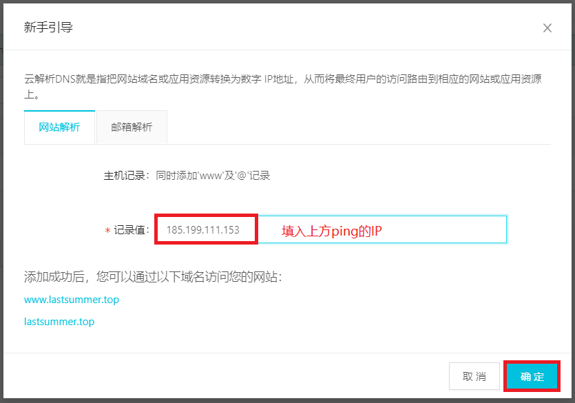

本文主要介绍了域名解析绑定及SSH部署博客到Github。
<!-- more -->
## Github绑定域名相关步骤
### Github注册
访问Github官方地址 [Github](https://github.com/)
输入用户名、电子邮箱、密码,然后点击注册按钮.-->之后验证邮箱（进入自己邮箱进行验证）
在github上面创建项目(借用github服务器)静态网站


在git命令框中安装git插件(cnpm install hexo-deployer-git --save)
打开Hexo安装目录，编辑_config.yml文件

``` bash
deploy:
  type: git
  repository: git@github.com:wangrui15034005712/wangrui15034005712.github.io.git
  branch: master
```
### Git使用ssh密钥
git支持https和git两种传输协议，github分享链接时会有两种协议可选：


我们要想生成SSH key，首先就得先安装 SSH，对于 Linux 和 Mac 系统，其默认是安装 SSH 的，而对于 Windows 系统，其默认是不安装 SSH 的，不过由于我们安装了 Git Bash，其也应该自带了 SSH. 可以通过在 Git Bash 中输入ssh命令，查看本机是否安装 SSH：

初次使用git的用户要使用git协议大概需要三个步骤：
一、生成密钥对
二、设置远程仓库（本文以github为例）上的公钥
三、把git的 remote url 修改为git协议（以上两个步骤初次设置过以后，以后使用都不需要再次设置，此步骤视以后项目的remote url而定，如果以后其他项目的协议为https则需要此步骤）
打开Hexo安装目录，右键git bash here点击


打开你的id_rsa.pub文件，复制下里面的内容，然后登录进去你的github；


至此，Github步骤结束。
### 域名购买解析
国内可以去几个大型的域名商去购买即可，直接搜域名购买，搜索引擎前几的都可以(万网、百度云、腾讯云、新网、西部数码、阿里云)，如果国外的可以去godday、name等站点去购买
访问阿里云官方地址 [阿里云](https://wanwang.aliyun.com/)
输入会员名、手机号、密码,然后点击注册按钮.-->之后验证手机(可通过淘宝或者支付宝进行登陆)





至此，域名解析步骤结束，我们可以通过自己的域名进行访问了。
